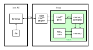

## Top minisystem design



It is required to develop a memory controller for the previous RISC core design.
The memory controller allows memory initialization or memory update from an outside source and memory content dump to an external destination. A basic protocol will be implemented to ensure an external form of UI. For the external access the FPGA system uses a serial interface (UART). The UART-USB physical driver ensures a virtual UART communication between the FPGA system and the host PC. On the PC side a proper terminal application drives the virtual UART connection (through a physical USB, but the details are left to the OS to manage) and ensures the file upload to, or download from the Simple RISC memory.
The Simple RISC computer comprises the Simple RISC core, the program memory and the data memory. The program and the data memories are seen by the RISC core as separate memories, with separate access ports for instructions and data. The physical memory is built from RAM blocks of appropriate size and it has two interfaces, one with the core (with separate instruction and data ports), the other with the memory controller.


## Protocol

```
general format:
┌──────────┬───────┬───────┬──────┬──────┬───────────────────┬──────┐
│ SFD=0xD5 │ Dnode │ Snode │ size │ type │ payload           │ FCS  │
│ (1B)     │ (1B)  │ (1B)  │ (2B) │ (1B) │ ...               │ (1B) │
└──────────┴───────┴───────┴──────┴──────┴───────────────────┴──────┘
request type 0-4:
                           ┌──────┬──────┬───────────────────┬──────┐
- reset, stop, start   ... │ 0    │ 0-2  │ ∅                │ FCS  │
                           │      │      │                   │      │
                           └──────┴──────┴───────────────────┴──────┘
                           ┌──────┬──────┬─────────┬─────────┬──────┐
- write                ... │ 3+N  │ 3    │ ADDR    │ data    │ FCS  │
                           │      │      │ (3B)    │ (NB)    │      │
                           └──────┴──────┴─────────┴─────────┴──────┘
                           ┌──────┬──────┬─────────┬─────────┬──────┐
- read                 ... │ 5    │ 4    │ ADDR    │ N       │ FCS  │
                           │      │      │ (3B)    │ (2B)    │      │
                           └──────┴──────┴─────────┴─────────┴──────┘
reply type 0-4:
                           ┌──────┬──────┬───────────────────┬──────┐
- reset, stop, start   ... │ 1    │ 0-2  │ STATUS            │ FCS  │
                           │      │      │ (1B)              │      │
                           └──────┴──────┴───────────────────┴──────┘
                           ┌──────┬──────┬───────────────────┬──────┐
- write                ... │ 1    │ 3    │ STATUS            │ FCS  │
                           │      │      │ (1B)              │      │
                           └──────┴──────┴───────────────────┴──────┘
                           ┌──────┬──────┬────────┬──────────┬──────┐
- read                 ... │ 1+2N|│ 4    │ STATUS │ data     │ FCS  │
                           │ 1+4N │      │ (1B)   │ (2N|4NB) │      │
                           └──────┴──────┴────────┴──────────┴──────┘
```

